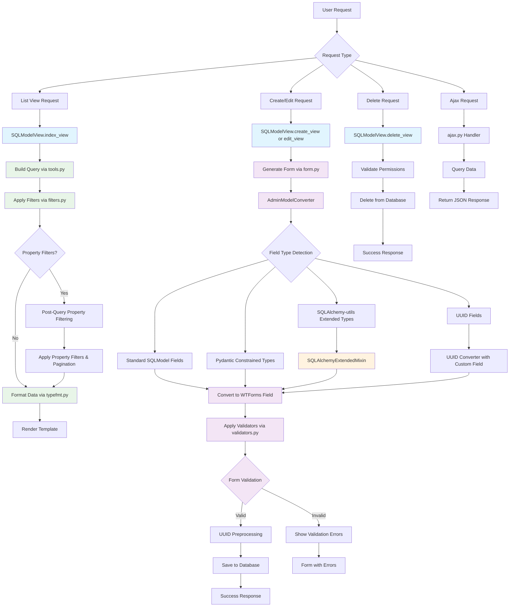
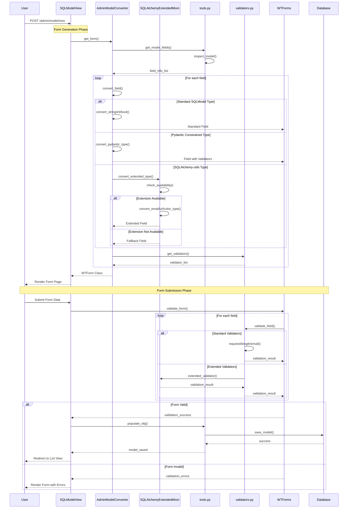
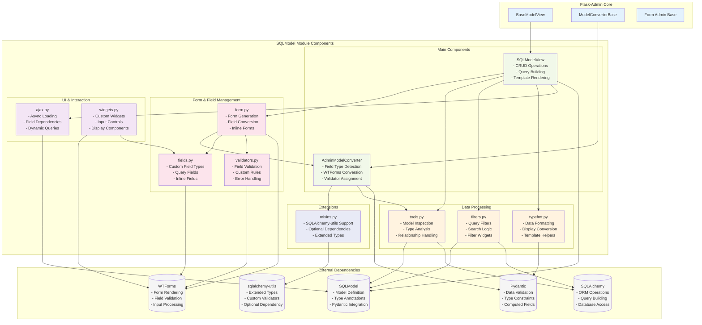

# SQLModel Code Structure

## SQLModel Module Directory Structure

This document provides a comprehensive overview of the `flask_admin/contrib/sqlmodel` module structure, including file descriptions, line counts, and key functionalities.

### Directory Tree

```
flask_admin/contrib/sqlmodel/
├── __init__.py                 (12 lines)
├── ajax.py                     (135 lines)
├── fields.py                   (456 lines)
├── filters.py                  (749 lines)
├── form.py                     (1,368 lines)
├── mixins.py                   (344 lines)
├── tools.py                    (1,370 lines)
├── typefmt.py                  (68 lines)
├── validators.py               (85 lines)
├── view.py                     (1,237 lines)
└── widgets.py                  (42 lines)
```

**Total**: 11 files, 5,866 lines of code

### File Descriptions

#### Core Files

##### `__init__.py` (12 lines)
- **Purpose**: Module initialization and public API exposure
- **Key Exports**: `SQLModelView`
- **Description**: Simple initialization file that exports the main view class

##### `view.py` (1,237 lines) 🏗️ **Core Component**
- **Purpose**: Main SQLModelView class implementation
- **Key Classes**: `SQLModelView`
- **Features**:
  - CRUD operations for SQLModel models
  - Query building and execution with UUID primary key support
  - **Property filtering with smart query routing and pagination**
  - Template rendering and response handling
  - Pagination, sorting, and search functionality
  - Integration with Flask-Admin base functionality

##### `form.py` (1,368 lines) 🏗️ **Core Component**
- **Purpose**: Form generation and field conversion system
- **Key Classes**: `AdminModelConverter`, `AdminModelInlineConverter`
- **Features**:
  - Automatic form generation from SQLModel models
  - **Native UUID field conversion and form preprocessing**
  - Field type detection and conversion to WTForms
  - **Field class overrides via view-level `form_overrides`**
  - Support for relationships and inline forms
  - Pydantic constrained types handling
  - Integration with mixin system for extended types

##### `tools.py` (1,370 lines) 🏗️ **Core Component**
- **Purpose**: Utility functions and model introspection
- **Key Functions**: Model analysis, type handling, relationship resolution
- **Features**:
  - SQLModel model inspection and metadata extraction
  - **Primary key type conversion from URL parameters** (`get_primary_key_types`, `convert_pk_from_url`)
  - Type annotation analysis and conversion
  - **Enhanced property and computed field detection with setter validation**
  - Relationship handling and foreign key resolution
  - Compatibility bridging between SQLModel and SQLAlchemy

#### Data Processing Files

##### `filters.py` (749 lines)
- **Purpose**: Query filtering and search functionality
- **Key Classes**: `BaseSQLModelFilter`, various filter classes for different data types
- **Features**:
  - Advanced filtering capabilities for database fields
  - **Post-query property filtering with special markers** (`__PROPERTY_FILTER__`)
  - Search functionality across model fields
  - Custom filter widgets and operators
  - Integration with SQLModel query system

##### `fields.py` (456 lines)
- **Purpose**: Custom field implementations
- **Key Classes**: Custom WTForms field types
- **Features**:
  - Query-based select fields
  - Inline model form fields
  - Custom field types for SQLModel-specific needs
  - Relationship field handling

##### `typefmt.py` (68 lines)
- **Purpose**: Data type formatting for display
- **Key Features**: Template helpers for data presentation
- **Features**:
  - Data formatting for different types
  - Display conversion utilities
  - Template integration helpers

#### Extension and Support Files

##### `mixins.py` (344 lines) 🔌 **Extension System**
- **Purpose**: SQLAlchemy-utils extended types support
- **Key Classes**: `SQLAlchemyExtendedMixin`
- **Features**:
  - Optional dependency management for sqlalchemy-utils
  - Extended type support (Email, URL, Color, Currency, etc.)
  - Graceful degradation when extensions are not available
  - Custom validators for extended types

##### `validators.py` (85 lines)
- **Purpose**: Field validation logic
- **Key Features**: Custom validation rules and error handling
- **Features**:
  - SQLModel-specific validators
  - Integration with WTForms validation system
  - Custom validation rules for complex types

#### UI and Interaction Files

##### `ajax.py` (135 lines)
- **Purpose**: Asynchronous data loading and AJAX support
- **Key Functions**: AJAX loaders for dynamic field population
- **Features**:
  - Dynamic field loading
  - Relationship data fetching
  - Async query execution for UI components

##### `widgets.py` (42 lines)
- **Purpose**: Custom UI widgets and form controls
- **Key Features**: Enhanced form widgets for SQLModel fields
- **Features**:
  - Custom input controls
  - Enhanced display components
  - Integration with form system

### Module Statistics

| Category | Files | Lines | Percentage |
|----------|-------|-------|------------|
| **Core Components** | 3 | 3,975 | 67.8% |
| **Data Processing** | 3 | 1,273 | 21.7% |
| **Extensions** | 2 | 429 | 7.3% |
| **UI/Interaction** | 2 | 177 | 3.0% |
| **Initialization** | 1 | 12 | 0.2% |

### Key Architecture Features

#### 🏗️ **Modular Design**
- Clear separation of concerns across different modules
- Each file has a specific responsibility in the system
- Easy to maintain and extend individual components

#### 🔌 **Mixin Architecture**
- Optional dependency management through mixins
- Graceful degradation when optional packages are missing
- Clean composition pattern for extending functionality

#### 🎯 **SQLModel Integration**
- Native support for SQLModel models and types
- **UUID Primary Key Support**: Full support for native SQLModel UUID fields with proper form handling
- **Property Filtering**: Advanced post-query filtering system for computed properties with pagination
- Pydantic integration for advanced validation
- Bridge between SQLModel and Flask-Admin ecosystems

#### 🛠️ **Extensibility**
- Support for custom fields, validators, and widgets
- Plugin architecture for additional functionality
- Easy integration with existing Flask-Admin features

### Recent Enhancements 🚀

#### **UUID Primary Key Support**
- Full support for native SQLModel `uuid.UUID` fields as primary keys
- Automatic form field conversion with proper UUID handling
- URL parameter type conversion for UUID primary keys in CRUD operations
- Comprehensive UUID CRUD testing

#### **Advanced Property Filtering**
- Post-query filtering system for computed properties and Python `@property` decorators
- Smart query routing to detect property filters vs database filters
- Proper pagination for property-filtered results
- Property filter markers (`__PROPERTY_FILTER__`) for seamless integration

#### **Enhanced Field Class Overrides**
- Clear separation between field-level and view-level overrides
- Recommended approach using view-level `form_overrides` dictionary
- Support for custom WTForms field classes like `TextAreaField`
- Integration with existing form scaffolding system

#### **Pure SQLModel Python Enum Support**
- Native support for Python enum types in SQLModel fields (without `sa_column`)
- Automatic dropdown generation with proper choice formatting
- Enum value coercion for form population and submission
- Enhanced `form_choices` integration with automatic enum detection
- Proper handling of Optional enum fields with nullable validation

#### **Enhanced Pydantic Type Support**
- Improved EmailStr field validation with proper WTForms integration
- Better handling of nullable Pydantic fields (EmailStr, URLs, IP addresses, UUIDs)
- Enhanced coercion functions for Pydantic types in form processing
- Consistent validation patterns across all Pydantic field types

#### **Comprehensive Test Coverage**
- Extensive test suite covering all major functionality
- Property filtering pagination tests
- UUID CRUD operation tests
- Field class override tests
- Integration and unit test coverage across all modules
---
## Mermaid charts for the sqlmodel moudle.

### SQLModel Flask-Admin Module Flowchart

This flowchart shows the main processing flow for the flask_admin/contrib/sqlmodel module, illustrating how data flows through the system from user request to response.


---

### SQLModel Flask-Admin Module Sequence Diagram

This sequence diagram illustrates the interaction flow between components when creating/editing a SQLModel record through Flask-Admin.


---
### SQLModel Flask-Admin Module Component Diagram

This component diagram shows the architecture and relationships between different modules in the flask_admin/contrib/sqlmodel package.


