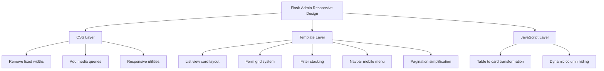

# Flask-Admin Responsive Design Plan

## Overview
This plan outlines the changes needed to make Flask-Admin fully responsive across all device sizes (mobile, tablet, desktop).

## Current State Analysis

### Bootstrap Version
- Uses **Bootstrap 4.2.1** which is responsive by default
- However, custom CSS and templates override responsive behavior

### Key Issues Identified
1. **Fixed widths** in CSS (`width: 130px`, `width: 220px`)
2. **Table-based layouts** that only scroll horizontally
3. **Form fields** not using Bootstrap's grid system
4. **Bootstrap 3 syntax** in some templates (`col-md-offset-2` instead of `offset-md-2`)
5. **No media queries** for mobile-specific behaviors
6. **List view tables** don't adapt to mobile screens

## Responsive Design Strategy



## Detailed Implementation Plan

### 1. CSS Layer Changes (`flask_admin/static/admin/css/bootstrap4/admin.css`)

#### 1.1 Remove Fixed Widths
```css
/* BEFORE */
.filters .filter-op { width: 130px; }
.filters .filter-val { width: 220px; }
.list-checkbox-column { width: 14px; }

/* AFTER */
.filters .filter-op { width: auto; min-width: 120px; }
.filters .filter-val { width: auto; min-width: 200px; flex: 1; }
.list-checkbox-column { width: auto; min-width: 40px; }
```

#### 1.2 Add Media Queries
```css
/* Mobile First Approach */
@media (max-width: 576px) {
    /* Stack filters vertically */
    table.filters tr {
        display: flex;
        flex-direction: column;
    }

    /* Hide less important columns */
    .hide-mobile {
        display: none !important;
    }

    /* Adjust button columns */
    .list-buttons-column {
        white-space: normal;
        width: 100%;
    }

    /* Full width inputs */
    .form-control {
        width: 100%;
    }
}

@media (min-width: 577px) and (max-width: 991px) {
    /* Tablet specific adjustments */
    .filters .filter-op {
        min-width: 100px;
    }
}
```

#### 1.3 Add Responsive Utilities
```css
/* Responsive table to card transformation */
.table-responsive-mobile .table thead {
    display: none;
}

.table-responsive-mobile .table tbody tr {
    display: block;
    margin-bottom: 1rem;
    border: 1px solid #dee2e6;
    border-radius: 0.25rem;
}

.table-responsive-mobile .table tbody td {
    display: flex;
    justify-content: space-between;
    padding: 0.5rem;
    border: none;
    border-bottom: 1px solid #dee2e6;
}

.table-responsive-mobile .table tbody td::before {
    content: attr(data-label);
    font-weight: bold;
}
```

### 2. Template Layer Changes

#### 2.1 List View (`flask_admin/templates/bootstrap4/admin/model/list.html`)

**Changes needed:**
- Add `data-label` attributes to table cells for mobile card layout
- Add responsive wrapper class
- Add CSS/JS for table-to-card transformation

```html
<!-- BEFORE -->
<div class="table-responsive">
    <table class="table table-striped table-bordered table-hover model-list">
        <thead>
            <tr>
                <th class="list-checkbox-column">...</th>
                <th>Name</th>
                <th>Email</th>
            </tr>
        </thead>
        <tbody>
            <tr>
                <td>...</td>
                <td>John Doe</td>
                <td>john@example.com</td>
            </tr>
        </tbody>
    </table>
</div>

<!-- AFTER -->
<div class="table-responsive table-responsive-mobile">
    <table class="table table-striped table-bordered table-hover model-list">
        <thead>
            <tr>
                <th class="list-checkbox-column">...</th>
                <th class="d-none d-md-table-cell">Name</th>
                <th class="d-none d-md-table-cell">Email</th>
            </tr>
        </thead>
        <tbody>
            <tr>
                <td>...</td>
                <td data-label="Name">John Doe</td>
                <td data-label="Email">john@example.com</td>
            </tr>
        </tbody>
    </table>
</div>
```

#### 2.2 Form Rendering (`flask_admin/templates/bootstrap4/admin/lib.html`)

**Changes needed:**
- Use Bootstrap 4 grid system for form fields
- Fix Bootstrap 3 syntax to Bootstrap 4
- Add responsive column classes

```jinja
<!-- BEFORE -->
<div class="form-group {{ kwargs.get('column_class', '') }}">
    <label>...</label>
    <input ...>
</div>

<!-- AFTER -->
<div class="form-group row {{ kwargs.get('column_class', 'col-12 col-md-6') }}">
    <label class="col-md-3 col-form-label">...</label>
    <div class="col-md-9">
        <input ...>
    </div>
</div>
```

**Fix Bootstrap 3 syntax:**
```jinja
<!-- BEFORE -->
<div class="col-md-offset-2 col-md-10 submit-row">

<!-- AFTER -->
<div class="offset-md-2 col-md-10 submit-row">
```

#### 2.3 Filter Forms (`flask_admin/templates/bootstrap4/admin/model/layout.html`)

**Changes needed:**
- Stack filters vertically on mobile
- Use flexbox for responsive layout

```jinja
<!-- BEFORE -->
<table class="filters">
    <tr>
        <td>...</td>
        <td>...</td>
        <td>...</td>
    </tr>
</table>

<!-- AFTER -->
<div class="filters-container d-flex flex-wrap">
    <div class="filter-item d-flex flex-column flex-sm-row">
        ...
    </div>
</div>
```

#### 2.4 Navbar (`flask_admin/templates/bootstrap4/admin/base.html`)

**Changes needed:**
- Ensure proper mobile menu behavior
- Add responsive utility classes

```html
<!-- Already has navbar-expand-lg which is good -->
<!-- Just need to ensure proper mobile menu behavior -->
<nav class="navbar navbar-expand-lg navbar-dark bg-dark mb-2">
    <button class="navbar-toggler" type="button" data-toggle="collapse" data-target="#admin-navbar-collapse">
        <span class="navbar-toggler-icon"></span>
    </button>
    <div class="collapse navbar-collapse" id="admin-navbar-collapse">
        <!-- Menu items -->
    </div>
</nav>
```

#### 2.5 Pagination (`flask_admin/templates/bootstrap4/admin/lib.html`)

**Changes needed:**
- Simplify pagination on mobile
- Hide some page numbers on small screens

```jinja
<!-- BEFORE -->
<ul class="pagination">
    <!-- All page numbers shown -->
</ul>

<!-- AFTER -->
<ul class="pagination">
    <li class="page-item d-none d-sm-block">
        <a class="page-link" href="{{ generator(0) }}">&laquo;</a>
    </li>
    <!-- Page numbers with d-none d-sm-block for some -->
</ul>
```

### 3. JavaScript Layer (Optional Enhancements)

#### 3.1 Dynamic Column Hiding
```javascript
// Hide less important columns on mobile
$(document).ready(function() {
    function adjustTableColumns() {
        if ($(window).width() < 768) {
            $('.hide-on-mobile').addClass('d-none');
        } else {
            $('.hide-on-mobile').removeClass('d-none');
        }
    }

    $(window).on('resize', adjustTableColumns);
    adjustTableColumns();
});
```

#### 3.2 Table to Card Transformation
```javascript
// Add data-label attributes dynamically if not present
$('.table-responsive-mobile tbody td').each(function() {
    var index = $(this).index();
    var headerText = $('.table-responsive-mobile thead th').eq(index).text();
    $(this).attr('data-label', headerText);
});
```

## Files to Modify

| File | Changes |
|------|---------|
| `flask_admin/static/admin/css/bootstrap4/admin.css` | Remove fixed widths, add media queries, add responsive utilities |
| `flask_admin/templates/bootstrap4/admin/model/list.html` | Add data-label attributes, responsive classes |
| `flask_admin/templates/bootstrap4/admin/lib.html` | Update form rendering with grid system, fix BS3 syntax |
| `flask_admin/templates/bootstrap4/admin/model/layout.html` | Update filter forms for stacking |
| `flask_admin/templates/bootstrap4/admin/base.html` | Minor navbar adjustments |
| `flask_admin/templates/bootstrap4/admin/model/create.html` | No changes needed (uses lib.html) |
| `flask_admin/templates/bootstrap4/admin/model/edit.html` | No changes needed (uses lib.html) |

## Responsive Breakpoints (Bootstrap 4)

| Breakpoint | Width | Target Devices |
|------------|-------|----------------|
| xs | < 576px | Extra small phones |
| sm | ≥ 576px | Small phones, large phones |
| md | ≥ 768px | Tablets |
| lg | ≥ 992px | Small laptops, desktops |
| xl | ≥ 1200px | Large desktops |

## Implementation Priority

1. **High Priority** (Core responsiveness)
   - Update admin.css with media queries
   - Fix form rendering with grid system
   - Update filter forms to stack on mobile

2. **Medium Priority** (Improved UX)
   - Transform table to card layout on mobile
   - Simplify pagination on mobile
   - Add dynamic column hiding

3. **Low Priority** (Nice to have)
   - JavaScript enhancements
   - Advanced responsive utilities

## Testing Checklist

- [ ] Test on mobile phone (375px - 428px)
- [ ] Test on tablet (768px - 1024px)
- [ ] Test on desktop (≥ 1200px)
- [ ] Test list view with many columns
- [ ] Test create/edit forms
- [ ] Test filter functionality
- [ ] Test pagination
- [ ] Test navbar menu on mobile
- [ ] Test action buttons on mobile
- [ ] Cross-browser testing (Chrome, Firefox, Safari)

## Notes

- The changes maintain backward compatibility
- Bootstrap 4's responsive utilities (`d-none`, `d-md-block`, etc.) are used
- Mobile-first approach is recommended
- Consider using custom templates for specific admin views if needed
